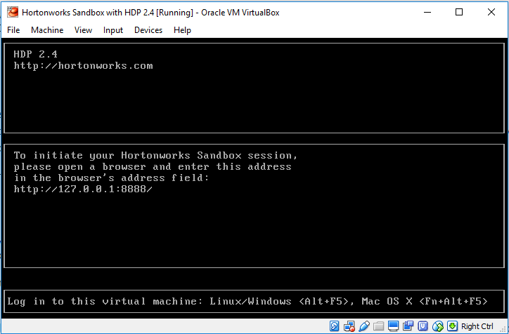

# Learning Spark with Zeppelin and Hortonworks Sandbox
Learning Spark with the Zeppelin notebook from the Hortonworks Sandbox VM

I've created this repo in order to catalog the differences between the setup I used and the one presented in the Eduonix [Learn Apache Spark from Scratch](https://www.eduonix.com/courses/Software-Development/Learn-Apache-Spark-from-Scratch-for-Beginners) course as I found it much simpler though Zeppelin may not have been in the sandbox at the time of course creation. 

## Getting Started 

### Install a Hypervisor 
You'll need to have either VMware (30 day trial) or Virtualbox environments installed already. If you don't have a preference, I'd suggest Virtualbox, though I've got examples for all 6 permutations regardless. 


#### Apple macOS
On macOS, this can be done via [Homebrew](http://brew.sh/):

```
brew install virtualbox
```

OR

```
brew install vmware-fusion
```

#### Microsoft Windows
On Windows, the excellent [Chocolatey](https://chocolatey.org/) comes to the rescue:

```
choco install virtualbox`
```

OR

```
choco install vmware-workstation
```

#### Ubuntu Linux LTS
On Ubuntu, things are slightly more complicated, but not insurmountable. 

Virtualbox:

```
sudo sh -c "echo 'deb http://download.virtualbox.org/virtualbox/debian '$(lsb_release -cs)' contrib non-free' > /etc/apt/sources.list.d/virtualbox.list" && \
wget -q http://download.virtualbox.org/virtualbox/debian/oracle_vbox.asc -O- | sudo apt-key add - && \
sudo apt-get update && sudo apt-get install virtualbox-5.0
```

VMware Workstation:

```
sudo apt-cache search linux-headers-$(uname -r)
sudo apt-get install linux-headers-$(uname -r)
sudo apt-get install build-essential
cd
mkdir vmware
cd vmware
wget https://www.vmware.com/go/tryworkstation-linux-64
chmod +x *.bundle
./*.bundle
```

### Download the Hortonwork Sandbox VM

This section really should not be needed, but at the time I took the course, the Hortonworks website refused to let me download the sandbox with anything other than Mozilla Firefox. This isn't a very large concern, but I'm hoping to help save you time before you try it in Chrome, then IE, then Safari on your Mac. 

Hortonworks download/survey link: http://hortonworks.com/products/sandbox/

### Start the VM

Once downloaded, you should be able to simply double click either the `vmdk` or `ova` you downloaded for your corresponding hypervisor in order to import it. 

Note that before starting the VM, I'd highly recommend setting your network adapter to `bridged mode` if your network environment allows it. 

Once started, you'll be met with a Hortonworks screen which will give you the IP address of the VM that we will use later on. 



### Connect to the Sandbox

At this point, you can either click into the VM or connect to it via SSH in order to change a few things. 

Note that in the course, there's a step for downloading Spark - this is no longer needed as the sandbox VM now includes it. 

### Change the SSH Password

### Change the Ambari Password

### Open Zeppelin in Your Browser
